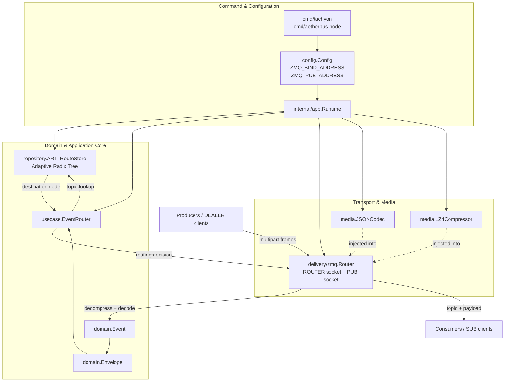

# AetherBus-Tachyon

**AetherBus-Tachyon** is a high-performance, lightweight message broker designed for the AetherBus ecosystem. It serves as a central routing point for events, ensuring efficient and reliable delivery from producers to consumers.

This project is currently under active development and aims to be a foundational component for building scalable, event-driven architectures.

## ✨ Features

- **High-Performance Routing:** Utilizes an **Adaptive Radix Tree** for fast and efficient topic-based routing, ensuring low-latency message delivery even with a large number of routes.
- **Extensible Media Handling:** Supports pluggable codecs and compressors to optimize message payloads.
  - **Codec:** Defaulting to `JSON` for structured data.
  - **Compressor:** Defaulting to `LZ4` for high-speed compression and decompression.
- **ZeroMQ Integration:** Built on top of ZeroMQ (using `pebbe/zmq4`), leveraging its powerful and battle-tested messaging patterns (ROUTER-DEALER, PUB-SUB).
- **Clean Architecture:** Organized with a clear separation of concerns (domain, use case, delivery, repository, media, app runtime) for maintainability and testability.
- **Continuous Integration:** Includes a **GitHub Actions workflow** that automatically builds the application and runs tests (including race detection) on every push and pull request to the `main` branch.

## 🚀 Getting Started

### Prerequisites

- [Go](https://golang.org/dl/) (version 1.22 or later)
- [ZeroMQ](https://zeromq.org/download/) (version 4.x)

On Debian/Ubuntu, you can install ZeroMQ development libraries with:

```bash
sudo apt-get update && sudo apt-get install -y libzmq3-dev
```

### Installation

1. **Clone the repository:**
   ```bash
   git clone https://github.com/aetherbus/aetherbus-tachyon.git
   cd aetherbus-tachyon
   ```

2. **Install dependencies:**
   ```bash
   go mod tidy
   ```

3. **Run the server:**
   ```bash
   go run ./cmd/tachyon
   ```

The server will start and bind to the addresses specified in the configuration (defaults to `tcp://127.0.0.1:5555` for the ROUTER and `tcp://127.0.0.1:5556` for the PUB socket).

Optional direct-delivery durability can be enabled with:

- `WAL_ENABLED=true`
- `WAL_PATH=./data/direct_delivery.wal`

When enabled, direct messages that require ACK are appended to an append-only WAL before dispatch, ACK marks entries committed, terminal outcomes are marked dead-lettered, and remaining unfinalized records are replayed when matching consumers reconnect after restart.

Direct-delivery admission control defaults are intentionally conservative and can be tuned with:

- `MAX_INFLIGHT_PER_CONSUMER` (default `1024`)
- `MAX_PER_TOPIC_QUEUE` (default `256`)
- `MAX_QUEUED_DIRECT` (default `4096`)
- `MAX_GLOBAL_INGRESS` (default `8192`)

When limits are reached, direct messages are deferred or dropped with explicit broker counters (`deferred`, `throttled`, `dropped`).

Direct-delivery admission control defaults are intentionally conservative and can be tuned with:

- `MAX_INFLIGHT_PER_CONSUMER` (default `1024`)
- `MAX_PER_TOPIC_QUEUE` (default `256`)
- `MAX_QUEUED_DIRECT` (default `4096`)
- `MAX_GLOBAL_INGRESS` (default `8192`)

When limits are reached, direct messages are deferred or dropped with explicit broker counters (`deferred`, `throttled`, `dropped`).

## 🧰 Build recovery under restricted network environments

This repository may require external Go module resolution to complete full recovery of
`go.mod` / `go.sum` and to run `go test ./...`.

To make troubleshooting easier, use the recovery helper:

### Offline-safe checks

Use this mode when your environment cannot reach external Go module infrastructure:

```bash
bash scripts/go_mod_recovery.sh check
```

This mode is useful for:

- validating repository structure
- checking command entrypoints
- running package-level tests for explicitly selected offline-safe packages

By default, it tests:

```bash
go test ./cmd/aetherbus
```

### Full online recovery

Use this mode on a machine or CI runner with module download access:

```bash
bash scripts/go_mod_recovery.sh recover
```

This runs:

- `go mod download`
- `go mod tidy`
- `go build ./...`
- `go test ./...`

### Diagnostics

To inspect the current Go environment:

```bash
bash scripts/go_mod_recovery.sh doctor
```

### Why this split exists

Some failures are caused by local source issues, while others are caused by incomplete
module metadata (`go.sum`) that cannot be repaired without downloading or verifying
dependencies.

In restricted-network environments, the offline-safe path helps confirm whether a failure
is local to the codebase or caused by module resolution limits.

If `recover` fails with module download/verification errors in restricted environments,
treat that as an environment limitation first (not an automatic source regression).


## ⚡ Benchmark harness

A first-class benchmark harness is available via `cmd/tachyon-bench`:

```bash
# direct mode with ACK
go run ./cmd/tachyon-bench harness --mode direct-ack --payload-class small --compress=true --duration 20s

# fanout benchmark
go run ./cmd/tachyon-bench harness --mode fanout --fanout-subs 8 --payload-class medium --compress=false --duration 20s

# mixed topic distribution
go run ./cmd/tachyon-bench harness --mode mixed --mixed-topics 8 --payload-class medium --compress=true --duration 30s

# CI-friendly matrix
go run ./cmd/tachyon-bench matrix --duration 10s --connections 2
```

The harness reports p50/p95/p99 latency, throughput, CPU usage, memory RSS, and allocations/op. See `docs/PERFORMANCE.md` for full interpretation guidance and comparison workflow.

## 🏗️ System Architecture Diagram



### Runtime composition

- **Command layer:** `cmd/tachyon` and `cmd/aetherbus-node` load configuration and start the broker runtime.
- **Configuration layer:** `config.Config` defines the ROUTER/PUB bind addresses.
- **Composition layer:** `internal/app.Runtime` wires the core components together.
- **Transport layer:** `internal/delivery/zmq.Router` owns the ZeroMQ ROUTER/PUB sockets and performs frame parsing.
- **Media layer:** `internal/media.JSONCodec` and `internal/media.LZ4Compressor` handle event encoding and payload compression.
- **Application layer:** `internal/usecase.EventRouter` resolves where an event should be routed.
- **Repository layer:** `internal/repository.ART_RouteStore` stores topic routes in an Adaptive Radix Tree.
- **Domain model:** `domain.Event` and `domain.Envelope` represent the message and routing metadata passed through the system.

### Message path

1. **Producers** publish multipart frames to the ZeroMQ ROUTER.
2. **`delivery/zmq.Router`** parses strict ROUTER frame shapes (`[client, topic, payload]` or `[client, "", topic, payload]`), validates topic syntax, decompresses payloads, and decodes them into `domain.Event`.
3. The transport layer wraps the event into **`domain.Envelope`**.
4. **`usecase.EventRouter`** performs topic lookup through **`repository.ART_RouteStore`**.
5. The routing decision returns to the transport layer.
6. The ZeroMQ PUB socket forwards the topic and payload to **subscribers / workers**.

This structure reflects the current codebase more closely than a generic broker diagram and keeps the runtime wiring, routing store, and transport/media responsibilities clearly separated.

## 🗃️ Data Storage Structure (Current)

The broker currently uses a **hybrid in-memory + append-only WAL** model instead of a full relational database. The logical data structures are:

### 1) Route store (in-memory ART)

- Purpose: topic-to-destination lookup for routing decisions
- Shape: key-value map over ART nodes
- Lifecycle: runtime memory only (reconstructed from bootstrap routes on restart)

| Field | Type | Description |
|---|---|---|
| `topic` | string | Topic key used for route lookup |
| `destination` | string | Target consumer/node identifier |

### 2) Direct consumer session table (in-memory)

- Purpose: active consumer capability/session tracking for direct delivery
- Shape: map keyed by `consumer_id`
- Lifecycle: runtime memory only

| Field | Type | Description |
|---|---|---|
| `consumer_id` | string | Stable consumer identity |
| `session_id` | string | Active session identifier |
| `socket_identity` | bytes | ZeroMQ ROUTER identity for direct send |
| `supports_ack` | bool | Whether consumer participates in ACK flow |
| `subscriptions` | set[string] | Topics subscribed for direct delivery |
| `max_inflight` | int | Consumer inflight window cap |
| `inflight_count` | int | Current number of inflight messages |
| `last_heartbeat` | timestamp | Last heartbeat seen from consumer |

### 3) Inflight delivery table (in-memory)

- Purpose: ACK/NACK, retry, timeout, and dead-letter control for direct mode
- Shape: map keyed by `message_id`
- Lifecycle: runtime memory; can be repopulated from WAL replay for unacked messages

| Field | Type | Description |
|---|---|---|
| `message_id` | string | Message identity used for ACK/NACK correlation |
| `consumer_id` | string | Target consumer for this attempt |
| `session_id` | string | Session that received the dispatch |
| `topic` | string | Routed topic |
| `payload` | bytes | Original payload bytes |
| `attempt` | int | Delivery attempt count |
| `dispatched_at` | timestamp | Dispatch time used for timeout evaluation |
| `status` | enum | `dispatched` / `acked` / `nacked` / `expired` / `retry_scheduled` / `dead_lettered` |

### 4) Delivery WAL (append-only file)

- Purpose: durability for direct messages requiring ACK
- Storage: JSON-line append log (default path `./data/direct_delivery.wal`)
- Recovery: uncommitted dispatch records are replayed when matching consumers re-register

| Field | Type | Description |
|---|---|---|
| `type` | enum | `dispatched`, `committed`, or `dead_lettered` |
| `message_id` | string | Message identity |
| `consumer` | string | Consumer identity for dispatched records |
| `session_id` | string | Session ID for dispatched records |
| `topic` | string | Topic for dispatched records |
| `payload` | bytes | Payload for dispatched records |
| `attempt` | int | Attempt number for dispatched records |

> Note: if you need SQL/NoSQL persistence in the future, this model can be mapped directly to tables/collections (`routes`, `consumer_sessions`, `inflight_messages`, `delivery_wal`) while preserving existing runtime semantics.


### Durability guarantees and non-goals

**Guarantees (when `WAL_ENABLED=true`):**
- Direct deliveries that require ACK are written to WAL before broker send.
- ACK and terminal dead-letter outcomes finalize WAL records, preventing replay.
- On restart, only unfinalized direct deliveries are replayed, preserving `message_id`, `consumer_id`, topic, payload, and attempt counter.

**Non-goals / current limitations:**
- WAL is local append-only file storage (single-node durability, no replication or consensus).
- WAL replay is scoped to consumers that re-register; replay is not global fanout recovery.
- WAL file compaction/retention is not implemented in this version.

## 💡 Function Proposals & Future Extensions

> This section intentionally lists **forward-looking proposals only**. Completed work should be documented in changelogs, release notes, or implementation-specific sections rather than mixed into the proposal backlog.

### English

- **Binary Frame Transport Path:** Introduce a compact binary frame header so the broker can route messages by topic without decoding large payloads first.
- **Large-payload Streaming Mode:** Add chunked transfer and streaming delivery for 1MB+ payload classes to reduce memory spikes and improve throughput.
- **Rust Fast-path Sidecar / FFI Module:** Move compression, framing, and large-payload processing into a Rust fast path while keeping Go for orchestration.
- **Schema Registry Integration:** Support schema version validation for structured payloads and safer producer/consumer evolution.
- **Rule-based Message Filtering:** Allow consumers to subscribe with filter expressions beyond exact topic matching.
- **Federation / Cluster Routing:** Extend single-node routing into multi-node broker meshes with route propagation and failover.
- **Benchmark & Profiling Harness:** Add a first-class benchmark command with p50/p95/p99 latency, throughput, memory, and allocation reporting.
- **Object-store Payload References:** Allow oversized payloads to be stored externally while the broker transports only metadata and retrieval references.
- **Durability Backends (SQLite/BoltDB/Badger):** Add pluggable local storage engines behind the current WAL abstraction for better operational flexibility.
- **Policy-driven Retention & Compaction:** Introduce retention windows and background compaction for WAL/inflight records to control disk growth.
- **Multi-tenant Quotas & Isolation:** Add tenant-scoped inflight limits, throughput quotas, and fairness scheduling.
- **Unified Observability Endpoint:** Expose metrics and delivery/session state snapshots via Prometheus + optional OpenTelemetry.

### ภาษาไทย

- **เส้นทางส่งข้อมูลแบบ Binary Frame:** เพิ่ม header แบบไบนารีเพื่อให้ broker ตัดสินใจ route ได้จากหัวข้อ โดยไม่ต้อง decode payload ขนาดใหญ่ก่อน
- **โหมดส่งข้อมูลขนาดใหญ่แบบ Streaming:** รองรับการแบ่งชิ้นและส่งต่อแบบ stream สำหรับ payload ระดับ 1MB ขึ้นไป เพื่อลดการใช้หน่วยความจำและเพิ่ม throughput
- **Rust Fast-path แบบ Sidecar / FFI:** ย้ายงาน framing, compression และเส้นทาง payload ใหญ่ไปยังโมดูล Rust โดยคง Go ไว้สำหรับ orchestration
- **การเชื่อมต่อ Schema Registry:** รองรับการตรวจสอบเวอร์ชันของ schema สำหรับ payload แบบ structured เพื่อให้ producer/consumer เปลี่ยนแปลงได้ปลอดภัยขึ้น
- **Rule-based Message Filtering:** ให้ consumer สมัครรับข้อความด้วยเงื่อนไขการกรองที่ยืดหยุ่นกว่าการ match topic แบบตรงตัว
- **Federation / Cluster Routing:** ขยายจาก single-node broker ไปสู่ broker mesh หลายโหนด พร้อม route propagation และ failover
- **Benchmark และ Profiling Harness:** เพิ่มคำสั่ง benchmark อย่างเป็นทางการ พร้อมรายงาน p50/p95/p99, throughput, memory และ allocations
- **Object-store Payload References:** เปิดทางให้ payload ที่มีขนาดใหญ่มากถูกเก็บภายนอก และให้ broker รับส่งเฉพาะ metadata กับ reference สำหรับดึงข้อมูล
- **Durability Backends (SQLite/BoltDB/Badger):** เพิ่มตัวเลือก storage engine แบบ pluggable ภายใต้ abstraction เดิมของ WAL เพื่อความยืดหยุ่นด้านปฏิบัติการ
- **Retention และ Compaction ตามนโยบาย:** เพิ่มนโยบายอายุข้อมูลและงาน compaction เบื้องหลังสำหรับ WAL/inflight เพื่อลดการเติบโตของไฟล์
- **Multi-tenant Quotas และ Isolation:** เพิ่มเพดาน inflight/throughput แยกตาม tenant พร้อมกลไกจัดสรรความยุติธรรม
- **Unified Observability Endpoint:** รวมการเปิดเผย metrics และ snapshot สถานะ delivery/session ผ่าน Prometheus และเลือกส่ง OpenTelemetry ได้

## 📘 Deep Architecture & Protocol Docs

To move AetherBus-Tachyon toward a production-grade broker spec, the repository now defines deeper system contracts in dedicated documents:

- [Protocol Specification v1 (draft)](docs/PROTOCOL.md)
- [Routing Semantics (ART)](docs/ROUTING.md)
- [Delivery Semantics (ACK/Retry/Backpressure/DLQ)](docs/DELIVERY.md)
- [Performance Model and Benchmarking](docs/PERFORMANCE.md)
- [Rust Fast-path Sidecar Scaffold](docs/FASTPATH_SIDECAR.md)
- [Intent Graph Algorithm Specification](docs/INTENT_GRAPH_ALGORITHM_SPEC.md)
- [Intent Core Phase 1 (single-node scaffold)](docs/INTENT_CORE_PHASE1.md)

### Delivery timeout configuration

Direct-delivery ACK tracking supports timeout-driven retries. Configure via:

- `DELIVERY_TIMEOUT_MS` (default: `30000`)

If an inflight direct message is not ACKed before this timeout, the broker treats it as retryable, retries within the direct retry budget, and dead-letters it once retries are exhausted.

These docs lock down the key areas that must be explicit for production evolution:

- Protocol envelope and control messages (register/ack/nack)
- Topic grammar and wildcard matching precedence
- Delivery guarantees and retry/dead-letter behavior
- Operational model (backpressure, failure handling, observability)

## Rust fast-path adapter boundary (scaffold)

The repository includes a scaffolded Rust sidecar (`rust/tachyon-fastpath`) and a narrow Go adapter boundary (`internal/fastpath`).

- Default runtime mode remains **Go-only** for backward-compatible behavior.
- Rust sidecar is an explicit opt-in integration path for large payload framing/compression offload.
- The first iteration intentionally uses a process boundary (Unix socket sidecar) to minimize risk to broker delivery semantics.

Fast-path sidecar configuration knobs are available for explicit developer testing:

- `FASTPATH_SIDECAR_ENABLED` (default `false`)
- `FASTPATH_SOCKET_PATH` (default `/tmp/tachyon-fastpath.sock`)
- `FASTPATH_CUTOVER_BYTES` (default `262144`)
- `FASTPATH_REQUIRE` (default `false`)
- `FASTPATH_FALLBACK_TO_GO` (default `true`)

See `docs/FASTPATH_SIDECAR.md` for architecture, activation criteria, and measurable migration candidates.

## Specifications

- [Protocol Specification](docs/PROTOCOL.md)
- [Routing Specification](docs/ROUTING.md)
- [Delivery Specification](docs/DELIVERY.md)
- [Intent Graph Algorithm Specification](docs/INTENT_GRAPH_ALGORITHM_SPEC.md)
- [Intent Core Phase 1](docs/INTENT_CORE_PHASE1.md)
