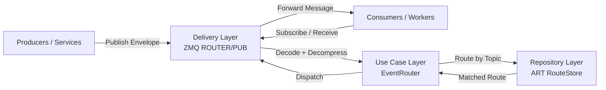

# AetherBus-Tachyon

**AetherBus-Tachyon** is a high-performance, lightweight message broker designed for the AetherBus ecosystem. It serves as a central routing point for events, ensuring efficient and reliable delivery from producers to consumers.

This project is currently under active development and aims to be a foundational component for building scalable, event-driven architectures.

## ✨ Features

- **High-Performance Routing:** Utilizes an **Adaptive Radix Tree** for fast and efficient topic-based routing, ensuring low-latency message delivery even with a large number of routes.
- **Extensible Media Handling:** Supports pluggable codecs and compressors to optimize message payloads.
  - **Codec:** Defaulting to `JSON` for structured data.
  - **Compressor:** Defaulting to `LZ4` for high-speed compression and decompression.
- **ZeroMQ Integration:** Built on top of ZeroMQ (using `pebbe/zmq4`), leveraging its powerful and battle-tested messaging patterns (ROUTER-DEALER, PUB-SUB).
- **Clean Architecture:** Organized with a clear separation of concerns (domain, use case, delivery, repository) for maintainability and testability.
- **Continuous Integration:** Includes a **GitHub Actions workflow** that automatically builds the application and runs tests (including race detection) on every push and pull request to the `main` branch.

## 🚀 Getting Started

### Prerequisites

- [Go](https://golang.org/dl/) (version 1.22 or later)
- [ZeroMQ](https://zeromq.org/download/) (version 4.x)

On Debian/Ubuntu, you can install ZeroMQ development libraries with:

```bash
sudo apt-get update && sudo apt-get install -y libzmq3-dev
```

### Installation

1. **Clone the repository:**
   ```bash
   git clone https://github.com/aetherbus/aetherbus-tachyon.git
   cd aetherbus-tachyon
   ```

2. **Install dependencies:**
   ```bash
   go mod tidy
   ```

3. **Run the server:**
   ```bash
   go run ./cmd/tachyon
   ```

The server will start and bind to the addresses specified in the configuration (defaults to `tcp://*:5555` for the ROUTER and `tcp://*:5556` for the PUB socket).


## 🧰 Build recovery under restricted network environments

This repository may require external Go module resolution to complete full recovery of
`go.mod` / `go.sum` and to run `go test ./...`.

To make troubleshooting easier, use the recovery helper:

### Offline-safe checks

Use this mode when your environment cannot reach external Go module infrastructure:

```bash
bash scripts/go_mod_recovery.sh check
```

This mode is useful for:

- validating repository structure
- checking command entrypoints
- running package-level tests for explicitly selected offline-safe packages

By default, it tests:

```bash
go test ./cmd/aetherbus
```

### Full online recovery

Use this mode on a machine or CI runner with module download access:

```bash
bash scripts/go_mod_recovery.sh recover
```

This runs:

- `go mod download`
- `go mod tidy`
- `go build ./...`
- `go test ./...`

### Diagnostics

To inspect the current Go environment:

```bash
bash scripts/go_mod_recovery.sh doctor
```

### Why this split exists

Some failures are caused by local source issues, while others are caused by incomplete
module metadata (`go.sum`) that cannot be repaired without downloading or verifying
dependencies.

In restricted-network environments, the offline-safe path helps confirm whether a failure
is local to the codebase or caused by module resolution limits.

If `recover` fails with module download/verification errors in restricted environments,
treat that as an environment limitation first (not an automatic source regression).

## 🏗️ System Architecture Diagram



1.  **Delivery Layer (`zmq`):** Handles the raw network communication. It receives messages from clients, decompresses and decodes them, and wraps them in a `domain.Envelope`.
2.  **Usecase Layer (`usecase`):** Contains the core business logic. The `EventRouter` takes an `Envelope`, uses the `RouteStore` to determine the destination, and orchestrates the next steps.
3.  **Repository Layer (`repository`):** Provides an abstraction over the data storage. The `ART_RouteStore` implements the `RouteStore` interface using a high-performance radix tree to store and match routing keys.

This separation allows for easy testing and swapping of components. For example, the `RouteStore` could be backed by a different data structure or a distributed key-value store without changing the use case logic.

## 💡 Function Proposals & Next-step Ideas

### English

- **Consumer Group Support:** Add named consumer groups with load-balanced delivery and offset/position tracking per group.
- **Message Replay Window:** Allow replay by timestamp or sequence for debugging, recovery, and audit use cases.
- **Policy-based Retry Pipelines:** Configure retry profiles per topic (max attempts, delay strategy, dead-letter target).
- **Authentication & Authorization:** Introduce token-based client authentication and topic-level ACL policies.
- **Observability Dashboard Hooks:** Expose metrics/events for queue depth, retry counts, drop rates, and end-to-end latency.

### ภาษาไทย

- **รองรับ Consumer Group:** เพิ่มการรวมกลุ่มผู้บริโภคแบบตั้งชื่อได้ พร้อมกระจายงานและติดตามตำแหน่งการอ่านต่อกลุ่ม
- **ความสามารถ Replay ข้อความ:** รองรับการดึงข้อความย้อนหลังตามเวลา/ลำดับ สำหรับดีบัก กู้คืน และงานตรวจสอบย้อนหลัง
- **Retry Pipeline แบบกำหนดนโยบาย:** ตั้งค่า retry รายหัวข้อ เช่น จำนวนครั้งสูงสุด กลยุทธ์หน่วงเวลา และปลายทาง DLQ
- **Authentication/Authorization:** เพิ่มการยืนยันตัวตนผู้ใช้งานและกำหนดสิทธิ์ระดับหัวข้อ (topic-level ACL)
- **Hook สำหรับงาน Observability:** เปิด metric/event สำคัญ เช่น คิวค้าง retry rate อัตราการตกหล่น และ latency แบบ end-to-end


## 📘 Deep Architecture & Protocol Docs

To move AetherBus-Tachyon toward a production-grade broker spec, the repository now defines deeper system contracts in dedicated documents:

- [Protocol Specification v1 (draft)](docs/PROTOCOL.md)
- [Routing Semantics (ART)](docs/ROUTING.md)
- [Delivery Semantics (ACK/Retry/Backpressure/DLQ)](docs/DELIVERY.md)
- [Performance Model and Benchmarking](docs/PERFORMANCE.md)

These docs lock down the key areas that must be explicit for production evolution:

- Protocol envelope and control messages (register/ack/nack)
- Topic grammar and wildcard matching precedence
- Delivery guarantees and retry/dead-letter behavior
- Operational model (backpressure, failure handling, observability)

## Specifications

- [Protocol Specification](docs/PROTOCOL.md)
- [Routing Specification](docs/ROUTING.md)
- [Delivery Specification](docs/DELIVERY.md)
