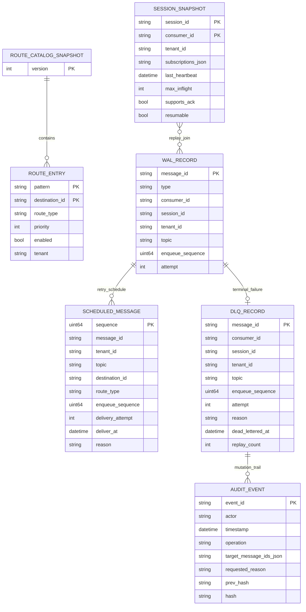
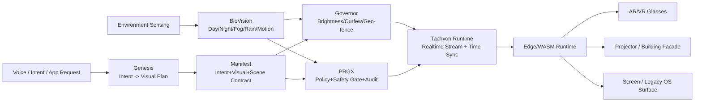

# AetherBus-Tachyon

**AetherBus-Tachyon** is a high-performance, lightweight message broker designed for the AetherBus ecosystem. It serves as a central routing point for events, ensuring efficient and reliable delivery from producers to consumers.

This project is currently under active development and aims to be a foundational component for building scalable, event-driven architectures.

## ✨ Features

- **High-Performance Routing:** Utilizes an **Adaptive Radix Tree** for fast and efficient topic-based routing, ensuring low-latency message delivery even with a large number of routes.
- **Extensible Media Handling:** Supports pluggable codecs and compressors to optimize message payloads.
  - **Codec:** Defaulting to `JSON` for structured data.
  - **Compressor:** Defaulting to `LZ4` for high-speed compression and decompression.
- **ZeroMQ Integration:** Built on top of ZeroMQ (using `pebbe/zmq4`), leveraging its powerful and battle-tested messaging patterns (ROUTER-DEALER, PUB-SUB).
- **Clean Architecture:** Organized with a clear separation of concerns (domain, use case, delivery, repository, media, app runtime) for maintainability and testability.
- **Continuous Integration:** Includes a **GitHub Actions workflow** that automatically builds the application and runs tests (including race detection) on every push and pull request to the `main` branch.

## 🚀 Getting Started

### Prerequisites

- [Go](https://golang.org/dl/) (version 1.22 or later)
- [ZeroMQ](https://zeromq.org/download/) (version 4.x)

On Debian/Ubuntu, you can install ZeroMQ development libraries with:

```bash
sudo apt-get update && sudo apt-get install -y libzmq3-dev
```

### Installation

1. **Clone the repository:**
   ```bash
   git clone https://github.com/aetherbus/aetherbus-tachyon.git
   cd aetherbus-tachyon
   ```

2. **Install dependencies:**
   ```bash
   go mod tidy
   ```

3. **Run the server:**
   ```bash
   go run ./cmd/tachyon
   ```

The server will start and bind to the addresses specified in the configuration (defaults to `tcp://127.0.0.1:5555` for the ROUTER and `tcp://127.0.0.1:5556` for the PUB socket).

Optional direct-delivery durability can be enabled with:

- `WAL_ENABLED=true`
- `WAL_PATH=./data/direct_delivery.wal`

When enabled, direct messages that require ACK are appended to an append-only WAL before dispatch, ACK marks entries committed, terminal outcomes are marked dead-lettered, and remaining unfinalized records are replayed when matching consumers reconnect after restart.


Dead-letter records are now materialized in a structured DLQ store at `WAL_PATH.dlq`, while broker-scheduled replays are written to `WAL_PATH.scheduled`. Administrative mutations are recorded in a separate append-only audit chain at `WAL_PATH.audit`, so compliance retention can differ from hot-path dispatch durability. Operators can browse and inspect DLQ entries, then replay or purge them with explicit confirmation and exact target matching so replay cannot silently change the original consumer/topic boundary.

### DLQ operator workflow

```bash
# Browse dead letters
go run ./cmd/tachyon dlq list --consumer worker-1

# Inspect a single record
go run ./cmd/tachyon dlq inspect --id msg-123

# Replay only when the original target is restated exactly
go run ./cmd/tachyon dlq replay --ids msg-123 --target-consumer worker-1 --target-topic orders.created --actor ops@example.com --reason "customer-approved replay" --confirm REPLAY

# Manually quarantine a message into the dead-letter store
go run ./cmd/tachyon dlq dead-letter --id msg-123 --consumer worker-1 --topic orders.created --payload "raw-body" --actor ops@example.com --reason "manual quarantine"

# Purge an acknowledged bad record
go run ./cmd/tachyon dlq purge --ids msg-123 --actor ops@example.com --mutation-reason "retention cleanup" --confirm PURGE

# Query immutable audit history by message, actor, or time window
go run ./cmd/tachyon dlq audit --id msg-123 --actor ops@example.com --start 2026-03-21T00:00:00Z --end 2026-03-22T00:00:00Z
```

The demo control-surface gateway exposes matching admin endpoints under `/api/admin/dlq/*` plus audit queries at `/api/admin/audit/events`. Set `ADMIN_TOKEN` to require the `X-Admin-Token` header for browse, inspect, replay, manual dead-letter, purge, and audit requests. Replay and purge responses include requested/replayed-or-purged counts plus per-record failure details.

### Audit retention and tamper evidence

- `WAL_PATH.audit` is intentionally separate from `WAL_PATH`, `WAL_PATH.dlq`, and `WAL_PATH.scheduled` so compliance retention can be longer than dispatch/replay retention.
- Each audit line stores actor, timestamp, operation, target message IDs, requested reason, prior state, resulting state, the previous record hash, and the current record hash.
- The `prev_hash` → `hash` chain is meant to make offline tampering detectable during export or forensic review; it is not a substitute for WORM/object-lock storage.
- Operationally, treat the audit log as append-only, rotate it with retention tooling that preserves line order, and export it to immutable storage when regulatory retention exceeds local disk policy.

Direct-delivery admission control defaults are intentionally conservative and can be tuned with:

- `MAX_INFLIGHT_PER_CONSUMER` (default `1024`)
- `MAX_PER_TOPIC_QUEUE` (default `256`)
- `MAX_QUEUED_DIRECT` (default `4096`)
- `MAX_GLOBAL_INGRESS` (default `8192`)

When limits are reached, direct messages are deferred or dropped with explicit broker counters (`deferred`, `throttled`, `dropped`).

## 🧰 Build recovery under restricted network environments

This repository may require external Go module resolution to complete full recovery of
`go.mod` / `go.sum` and to run `go test ./...`.

To make troubleshooting easier, use the recovery helper:

### Offline-safe checks

Use this mode when your environment cannot reach external Go module infrastructure:

```bash
bash scripts/go_mod_recovery.sh check
```

This mode is useful for:

- validating repository structure
- checking command entrypoints
- running package-level tests for explicitly selected offline-safe packages

By default, it tests:

```bash
go test ./cmd/aetherbus
```

### Full online recovery

Use this mode on a machine or CI runner with module download access:

```bash
bash scripts/go_mod_recovery.sh recover
```

This runs:

- `go mod download`
- `go mod tidy`
- `go build ./...`
- `go test ./...`

### Diagnostics

To inspect the current Go environment:

```bash
bash scripts/go_mod_recovery.sh doctor
```

### Why this split exists

Some failures are caused by local source issues, while others are caused by incomplete
module metadata (`go.sum`) that cannot be repaired without downloading or verifying
dependencies.

In restricted-network environments, the offline-safe path helps confirm whether a failure
is local to the codebase or caused by module resolution limits.

If `recover` fails with module download/verification errors in restricted environments,
treat that as an environment limitation first (not an automatic source regression).


## ⚡ Benchmark harness

A first-class benchmark harness is available via `cmd/tachyon-bench`:

```bash
# direct mode with ACK
go run ./cmd/tachyon-bench harness --mode direct-ack --payload-class small --compress=true --duration 20s

# fanout benchmark
go run ./cmd/tachyon-bench harness --mode fanout --fanout-subs 8 --payload-class medium --compress=false --duration 20s

# mixed topic distribution
go run ./cmd/tachyon-bench harness --mode mixed --mixed-topics 8 --payload-class medium --compress=true --duration 30s

# CI-friendly matrix
go run ./cmd/tachyon-bench matrix --duration 10s --connections 2
```

The harness reports p50/p95/p99 latency, throughput, CPU usage, memory RSS, and allocations/op. See `docs/PERFORMANCE.md` for full interpretation guidance and comparison workflow.

## 🏗️ System Architecture Diagram (Database + Module Contracts)

> เป้าหมาย: ทำให้ภาพสถาปัตยกรรมอ้างอิง “โครงสร้างข้อมูลที่ persist จริง” และ “เส้นทางควบคุมระหว่างโมดูล” เพื่อไม่ปะปนกับรายการงานที่ปิดแล้ว



### High-Level Augmented Perception Layer (L9 blueprint)



### C4 (Text)

#### 1) Context
- **Actors:** End-user, Developer, Enterprise Operator, Regulator/Community authority.
- **System:** AetherBus-Tachyon as event + light-orchestration backbone.
- **External systems:** Android/iOS/Windows apps, AR/VR runtime, projector controllers, observability stack, policy registry.

#### 2) Container
- **Manifest Service:** contract registry + versioning + compatibility checks.
- **Genesis Service:** speech/intent normalization + scene graph planning.
- **BioVision Service:** environment inference and perceptual adaptation.
- **Governor Service:** legal/safety policy controls (brightness, curfew, geofence).
- **PRGX Service:** abuse prevention, content safety, policy enforcement, immutable audit.
- **Tachyon Transport:** low-latency command/data stream, ordering, retry, dedup, time sync.
- **Edge/WASM Runtime:** local render execution + fallback when network degraded.
- **State Plane (DB/WAL/DLQ/Audit):** durable state + replay + forensic record.

#### 3) Component (within Tachyon + State Plane)
- **Router + EventRouter:** route resolution and fanout/direct path.
- **Session Store:** consumer capability + heartbeat.
- **Inflight/WAL Manager:** ack, retry, timeout, dead-letter transitions.
- **Scheduled Queue:** delayed replay and curfew-window release.
- **DLQ/Audit Manager:** operator workflows with hash-chain evidence.

### Dataflow / Controlflow

1. **Voice/Intent path:** Input -> Genesis -> Manifest validation -> PRGX/Governor gates -> Tachyon stream -> Edge/WASM -> display endpoint.
2. **BioVision path:** Sensor/video telemetry -> BioVision adaptive scores -> Governor limit calculation + PRGX safety checks -> Manifest parameter override -> Tachyon emission.
3. **State path:** Each delivery/ack/retry/dead-letter mutation writes through WAL -> Scheduled/DLQ -> Audit chain, enabling replay + compliance traceability.

### Inspira-Firma Duality (single intent, two render modes)

- **Mode A: Legacy OS mode**
  - Intent resolves to Android/iOS/Windows app action.
  - Tachyon emits control events; output remains native OS UI.
- **Mode B: Light-native mode**
  - Same intent resolves to visual contract + scene contract.
  - Edge runtime renders as projected/overlay light interface.
- **Switch policy:** per-intent metadata (`render_mode=legacy|light|adaptive`) and policy fallback when safety/risk is triggered.

## 🧭 Known Issues, Gaps, and Corrective Actions

| Area | Problem observed | Impact | Corrective action |
|---|---|---|---|
| Contract governance | Intent/Visual schema lifecycle not centralized | version drift, integration breakage | Introduce schema registry + semver policy + compatibility CI gate |
| Time sync | No explicit predicted-display-time contract at module boundary | jitter and late projection in moving scenes | Add monotonic timestamp + PTP/NTP offset model + predicted display timestamp |
| Safety gating | Governor/PRGX constraints not yet declared as unified policy bundle | inconsistent enforcement per deployment | Define policy package (`brightness`, `curfew`, `geo`, `content-risk`) signed + versioned |
| Observability | Cross-module trace correlation still partial | difficult RCA in real-time incidents | Standardize trace/span + delivery IDs from ingress to replay/audit |
| Edge resilience | reconnect/reconciliation flow not fully formalized | duplicate output or stale state after network flap | Add checkpoint sequence + idempotent reapply + state digest handshake |

## 💡 Proposed Backlog (Pending / Not Yet Implemented)

1. **Intent & Visual Contract Registry** with backward-compatibility matrix and automated migration hints.
2. **Predictive Render Scheduler** that aligns motion-to-light with scene velocity and device refresh.
3. **Geo-aware Community Safety Pack** (quiet hours, school-zone limits, emergency override).
4. **Policy Simulation Sandbox** to dry-run PRGX/Governor rules before production rollout.
5. **Multi-surface Consistency Engine** to keep projector, glasses, and monitor outputs frame-aligned.
6. **Tenant-level Cost and Carbon Metering** for enterprise accountability and optimization.
7. **Replay Forensics Toolkit** for DLQ/audit timeline reconstruction and signed evidence export.
8. **Edge WASM Capability Discovery** so one contract can compile to multiple device classes safely.

## 🗺️ 4-Phase Production Roadmap

| Phase | Deliverables | Primary risks | Exit criteria | Metrics |
|---|---|---|---|---|
| **P0 PoC (0-8 weeks)** | Genesis->Manifest->Tachyon happy path, basic BioVision adaptive brightness, WAL+DLQ minimal loop | latency instability, contract ambiguity | end-to-end demo across 2 device classes | p95 e2e < 220ms, success rate > 98% |
| **P1 Prototype (2-4 months)** | Governor+PRGX enforceable policy bundle, benchmark harness, reconnect+replay protocol | false-positive safety blocks, replay defects | limited real-site deployment with operator runbook | policy decision < 20ms p95, replay correctness = 100% sampled |
| **P2 Pilot (4-8 months)** | enterprise multi-tenant controls, audit export, adaptive scene sync in dynamic environments | tenant isolation gaps, operational overhead | first design partners run 24/7 pilot safely | uptime > 99.5%, incident MTTR < 30m |
| **P3 Production (8-12 months)** | scale hardening, HA state plane, compliance posture, cost/perf optimization | cost blowout, regional policy variance | production SLO/SLA acceptance + security sign-off | uptime > 99.9%, motion-to-light p95 < 120ms (AR) |

## ❓ Open Questions and Assumptions

### Open questions
- ขอบเขตกฎหมายท้องถิ่นสำหรับการฉายบนอาคาร/พื้นที่สาธารณะในแต่ละเมืองที่ต้องรองรับเป็น baseline คืออะไร?
- ระดับความแม่นยำ time sync ที่อุปกรณ์ปลายทางรองรับจริง (PTP/NTP/GPS clock) อยู่ที่เท่าใด?
- ต้องรองรับ content moderation แบบ on-device หรือ cloud-first เป็นหลัก?

### Working assumptions
- เริ่มจาก deployment แบบเขตจำกัด (controlled zone) เพื่อลด blast radius.
- ใช้ policy-as-code และ immutable audit เป็นข้อบังคับทุก environment.
- ระบบต้อง degrade gracefully ไปยัง Legacy OS mode เมื่อ safety gate ไม่ผ่านหรือ latency เกินงบ.

## 🔐 Project Policies

- [Security Policy](SECURITY.md)
- [Copyright Notice](COPYRIGHT.md)

## 📘 Deep Architecture & Protocol Docs

To move AetherBus-Tachyon toward a production-grade broker spec, the repository now defines deeper system contracts in dedicated documents:

- [Protocol Specification v1 (draft)](docs/PROTOCOL.md)
- [Routing Semantics (ART)](docs/ROUTING.md)
- [Delivery Semantics (ACK/Retry/Backpressure/DLQ)](docs/DELIVERY.md)
- [Performance Model and Benchmarking](docs/PERFORMANCE.md)
- [Rust Fast-path Sidecar Scaffold](docs/FASTPATH_SIDECAR.md)
- [Intent Graph Algorithm Specification](docs/INTENT_GRAPH_ALGORITHM_SPEC.md)
- [Intent Core Phase 1 (single-node scaffold)](docs/INTENT_CORE_PHASE1.md)

### Delivery timeout configuration

Direct-delivery ACK tracking supports timeout-driven retries. Configure via:

- `DELIVERY_TIMEOUT_MS` (default: `30000`)

If an inflight direct message is not ACKed before this timeout, the broker treats it as retryable, retries within the direct retry budget, and dead-letters it once retries are exhausted.

These docs lock down the key areas that must be explicit for production evolution:

- Protocol envelope and control messages (register/ack/nack)
- Topic grammar and wildcard matching precedence
- Delivery guarantees and retry/dead-letter behavior
- Operational model (backpressure, failure handling, observability)

## Rust fast-path adapter boundary (scaffold)

The repository includes a scaffolded Rust sidecar (`rust/tachyon-fastpath`) and a narrow Go adapter boundary (`internal/fastpath`).

- Default runtime mode remains **Go-only** for backward-compatible behavior.
- Rust sidecar is an explicit opt-in integration path for large payload framing/compression offload.
- The first iteration intentionally uses a process boundary (Unix socket sidecar) to minimize risk to broker delivery semantics.

Fast-path sidecar configuration knobs are available for explicit developer testing:

- `FASTPATH_SIDECAR_ENABLED` (default `false`)
- `FASTPATH_SOCKET_PATH` (default `/tmp/tachyon-fastpath.sock`)
- `FASTPATH_CUTOVER_BYTES` (default `262144`)
- `FASTPATH_REQUIRE` (default `false`)
- `FASTPATH_FALLBACK_TO_GO` (default `true`)

See `docs/FASTPATH_SIDECAR.md` for architecture, activation criteria, and measurable migration candidates.

## Specifications

- [Protocol Specification](docs/PROTOCOL.md)
- [Routing Specification](docs/ROUTING.md)
- [Delivery Specification](docs/DELIVERY.md)
- [Intent Graph Algorithm Specification](docs/INTENT_GRAPH_ALGORITHM_SPEC.md)
- [Intent Core Phase 1](docs/INTENT_CORE_PHASE1.md)
