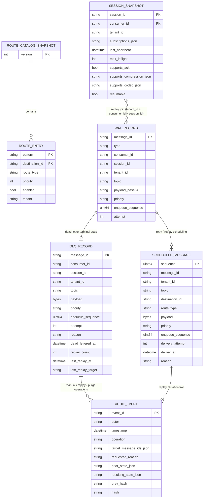

# AetherBus-Tachyon

**AetherBus-Tachyon** is a high-performance, lightweight message broker designed for the AetherBus ecosystem. It serves as a central routing point for events, ensuring efficient and reliable delivery from producers to consumers.

This project is currently under active development and aims to be a foundational component for building scalable, event-driven architectures.

## ✨ Features

- **High-Performance Routing:** Utilizes an **Adaptive Radix Tree** for fast and efficient topic-based routing, ensuring low-latency message delivery even with a large number of routes.
- **Extensible Media Handling:** Supports pluggable codecs and compressors to optimize message payloads.
  - **Codec:** Defaulting to `JSON` for structured data.
  - **Compressor:** Defaulting to `LZ4` for high-speed compression and decompression.
- **ZeroMQ Integration:** Built on top of ZeroMQ (using `pebbe/zmq4`), leveraging its powerful and battle-tested messaging patterns (ROUTER-DEALER, PUB-SUB).
- **Clean Architecture:** Organized with a clear separation of concerns (domain, use case, delivery, repository, media, app runtime) for maintainability and testability.
- **Continuous Integration:** Includes a **GitHub Actions workflow** that automatically builds the application and runs tests (including race detection) on every push and pull request to the `main` branch.

## 🚀 Getting Started

### Prerequisites

- [Go](https://golang.org/dl/) (version 1.22 or later)
- [ZeroMQ](https://zeromq.org/download/) (version 4.x)

On Debian/Ubuntu, you can install ZeroMQ development libraries with:

```bash
sudo apt-get update && sudo apt-get install -y libzmq3-dev
```

### Installation

1. **Clone the repository:**
   ```bash
   git clone https://github.com/aetherbus/aetherbus-tachyon.git
   cd aetherbus-tachyon
   ```

2. **Install dependencies:**
   ```bash
   go mod tidy
   ```

3. **Run the server:**
   ```bash
   go run ./cmd/tachyon
   ```

The server will start and bind to the addresses specified in the configuration (defaults to `tcp://127.0.0.1:5555` for the ROUTER and `tcp://127.0.0.1:5556` for the PUB socket).

Optional direct-delivery durability can be enabled with:

- `WAL_ENABLED=true`
- `WAL_PATH=./data/direct_delivery.wal`

When enabled, direct messages that require ACK are appended to an append-only WAL before dispatch, ACK marks entries committed, terminal outcomes are marked dead-lettered, and remaining unfinalized records are replayed when matching consumers reconnect after restart.


Dead-letter records are now materialized in a structured DLQ store at `WAL_PATH.dlq`, while broker-scheduled replays are written to `WAL_PATH.scheduled`. Administrative mutations are recorded in a separate append-only audit chain at `WAL_PATH.audit`, so compliance retention can differ from hot-path dispatch durability. Operators can browse and inspect DLQ entries, then replay or purge them with explicit confirmation and exact target matching so replay cannot silently change the original consumer/topic boundary.

### DLQ operator workflow

```bash
# Browse dead letters
go run ./cmd/tachyon dlq list --consumer worker-1

# Inspect a single record
go run ./cmd/tachyon dlq inspect --id msg-123

# Replay only when the original target is restated exactly
go run ./cmd/tachyon dlq replay --ids msg-123 --target-consumer worker-1 --target-topic orders.created --actor ops@example.com --reason "customer-approved replay" --confirm REPLAY

# Manually quarantine a message into the dead-letter store
go run ./cmd/tachyon dlq dead-letter --id msg-123 --consumer worker-1 --topic orders.created --payload "raw-body" --actor ops@example.com --reason "manual quarantine"

# Purge an acknowledged bad record
go run ./cmd/tachyon dlq purge --ids msg-123 --actor ops@example.com --mutation-reason "retention cleanup" --confirm PURGE

# Query immutable audit history by message, actor, or time window
go run ./cmd/tachyon dlq audit --id msg-123 --actor ops@example.com --start 2026-03-21T00:00:00Z --end 2026-03-22T00:00:00Z
```

The demo control-surface gateway exposes matching admin endpoints under `/api/admin/dlq/*` plus audit queries at `/api/admin/audit/events`. Set `ADMIN_TOKEN` to require the `X-Admin-Token` header for browse, inspect, replay, manual dead-letter, purge, and audit requests. Replay and purge responses include requested/replayed-or-purged counts plus per-record failure details.

### Audit retention and tamper evidence

- `WAL_PATH.audit` is intentionally separate from `WAL_PATH`, `WAL_PATH.dlq`, and `WAL_PATH.scheduled` so compliance retention can be longer than dispatch/replay retention.
- Each audit line stores actor, timestamp, operation, target message IDs, requested reason, prior state, resulting state, the previous record hash, and the current record hash.
- The `prev_hash` → `hash` chain is meant to make offline tampering detectable during export or forensic review; it is not a substitute for WORM/object-lock storage.
- Operationally, treat the audit log as append-only, rotate it with retention tooling that preserves line order, and export it to immutable storage when regulatory retention exceeds local disk policy.

Direct-delivery admission control defaults are intentionally conservative and can be tuned with:

- `MAX_INFLIGHT_PER_CONSUMER` (default `1024`)
- `MAX_PER_TOPIC_QUEUE` (default `256`)
- `MAX_QUEUED_DIRECT` (default `4096`)
- `MAX_GLOBAL_INGRESS` (default `8192`)

When limits are reached, direct messages are deferred or dropped with explicit broker counters (`deferred`, `throttled`, `dropped`).

## 🧰 Build recovery under restricted network environments

This repository may require external Go module resolution to complete full recovery of
`go.mod` / `go.sum` and to run `go test ./...`.

To make troubleshooting easier, use the recovery helper:

### Offline-safe checks

Use this mode when your environment cannot reach external Go module infrastructure:

```bash
bash scripts/go_mod_recovery.sh check
```

This mode is useful for:

- validating repository structure
- checking command entrypoints
- running package-level tests for explicitly selected offline-safe packages

By default, it tests:

```bash
go test ./cmd/aetherbus
```

### Full online recovery

Use this mode on a machine or CI runner with module download access:

```bash
bash scripts/go_mod_recovery.sh recover
```

This runs:

- `go mod download`
- `go mod tidy`
- `go build ./...`
- `go test ./...`

### Diagnostics

To inspect the current Go environment:

```bash
bash scripts/go_mod_recovery.sh doctor
```

### Why this split exists

Some failures are caused by local source issues, while others are caused by incomplete
module metadata (`go.sum`) that cannot be repaired without downloading or verifying
dependencies.

In restricted-network environments, the offline-safe path helps confirm whether a failure
is local to the codebase or caused by module resolution limits.

If `recover` fails with module download/verification errors in restricted environments,
treat that as an environment limitation first (not an automatic source regression).


## ⚡ Benchmark harness

A first-class benchmark harness is available via `cmd/tachyon-bench`:

```bash
# direct mode with ACK
go run ./cmd/tachyon-bench harness --mode direct-ack --payload-class small --compress=true --duration 20s

# fanout benchmark
go run ./cmd/tachyon-bench harness --mode fanout --fanout-subs 8 --payload-class medium --compress=false --duration 20s

# mixed topic distribution
go run ./cmd/tachyon-bench harness --mode mixed --mixed-topics 8 --payload-class medium --compress=true --duration 30s

# CI-friendly matrix
go run ./cmd/tachyon-bench matrix --duration 10s --connections 2
```

The harness reports p50/p95/p99 latency, throughput, CPU usage, memory RSS, and allocations/op. See `docs/PERFORMANCE.md` for full interpretation guidance and comparison workflow.

## 🏗️ System Architecture Diagram (Database-Aligned)



This view maps directly to persisted Go shapes: `domain.RouteCatalogSnapshot/Route`, `sessionSnapshot`, `walRecord`, `scheduledMessage`, `DeadLetterRecord`, and `audit.Event`. Each persistence file (`ROUTE_CATALOG_PATH`, `WAL_PATH.segments`, `WAL_PATH.sessions`, `WAL_PATH.scheduled`, `WAL_PATH.dlq`, `WAL_PATH.audit`) is represented using those stored fields rather than inferred placeholders.

### Runtime composition

- **Command layer:** `cmd/tachyon` and `cmd/aetherbus-node` load configuration, durability flags, and start the broker runtime.
- **Configuration layer:** `config.Config` and environment variables define bind addresses, admission limits, timeout behavior, and WAL activation.
- **Composition layer:** `internal/app.Runtime` wires transport, routing, session tracking, inflight control, and persistence together.
- **Transport layer:** `internal/delivery/zmq.Router` owns the ZeroMQ ROUTER/PUB sockets, parses frames, handles consumer registration/heartbeats, and emits direct/fanout deliveries.
- **Media layer:** `internal/media.JSONCodec` and `internal/media.LZ4Compressor` handle event encoding and payload compression.
- **Application layer:** `internal/usecase.EventRouter` resolves fanout routes and coordinates routing decisions with broker state.
- **Logical data layer:** the runtime operates over a hybrid state model — route catalog, consumer sessions, inflight messages, scheduled retries, WAL segments, DLQ records, and append-only audit events.

### Message + state flow

1. **Producers** publish multipart frames to the ZeroMQ ROUTER.
2. **`delivery/zmq.Router`** validates frame shape, decodes/compresses payloads via the media layer, and forwards routing work into the application flow.
3. **`usecase.EventRouter`** resolves topic matches through the **route catalog** for fanout delivery.
4. **Consumer registration and heartbeat traffic** upserts **consumer sessions**, tracking active direct-delivery capability.
5. **Direct deliveries** update runtime inflight state and persist **WAL dispatched records** so ACK/NACK, retry, timeout, and dead-letter rules are deterministic after restart.
6. When ACK durability is required, state transitions are appended to the **delivery WAL** and replay schedules are persisted in **scheduled deliveries**.
7. Terminal failures are written into **DLQ records**, while replay/purge/manual dead-letter actions append to **audit events** with hash chaining.
8. The transport layer emits final topic payloads or direct-delivery frames back to **subscribers / workers**.

This database-aligned diagram intentionally focuses on authoritative state and relationships so operators can map broker behavior to backup, retention, and compliance controls more directly.

## 💡 Function Proposals & Future Extensions

### English

- **Policy-based Retry Engine:** Attach retry curves (`linear`, `exponential`, `jitter`) by topic or tenant with caps and blackout windows.
- **Schema Registry + Compatibility Gate:** Validate payload contracts before publish and block incompatible version drift.
- **Cross-region Read Replica for DLQ/Audit:** Stream DLQ and audit chains to read-only replicas for compliance and incident response.
- **Adaptive Queue Rebalancer:** Move deferred queues between workers based on heartbeat quality, inflight pressure, and latency trends.
- **Operator Runbook API:** Publish machine-readable remediation playbooks for common incidents (retry storm, consumer flap, DLQ spike).
- **Message Trace Correlation:** Add trace/span identifiers from ingress to replay for distributed debugging.
- **Tenant Billing Metrics Export:** Emit metered usage by tenant/topic for chargeback and quota governance.
- **Key Rotation Workflow:** Support envelope-key rotation for encrypted payloads without broker downtime.

### ภาษาไทย

- **Policy-based Retry Engine:** กำหนดนโยบาย retry (`linear`, `exponential`, `jitter`) แยกตาม topic หรือ tenant พร้อมเพดานและช่วงเวลาหยุดส่ง
- **Schema Registry + Compatibility Gate:** ตรวจสอบสัญญา payload ก่อน publish และป้องกันการเปลี่ยนเวอร์ชันที่ไม่เข้ากัน
- **Cross-region Read Replica for DLQ/Audit:** สตรีม DLQ และ audit chain ไปยัง read-only replica ข้ามภูมิภาคเพื่อ compliance และ incident response
- **Adaptive Queue Rebalancer:** ย้าย deferred queue ระหว่าง worker ตามคุณภาพ heartbeat, แรงกดดัน inflight และแนวโน้ม latency
- **Operator Runbook API:** เปิด API สำหรับ runbook แบบ machine-readable เพื่อรับมือเหตุขัดข้องที่พบบ่อย (retry storm, consumer flap, DLQ spike)
- **Message Trace Correlation:** เพิ่ม trace/span identifier ตั้งแต่รับข้อความจน replay เพื่อช่วยวิเคราะห์ปัญหาแบบ distributed
- **Tenant Billing Metrics Export:** ส่งออกสถิติการใช้งานราย tenant/topic เพื่อทำ chargeback และกำกับ quota
- **Key Rotation Workflow:** รองรับการหมุนคีย์เข้ารหัส payload แบบไม่ต้องหยุด broker

## 🔐 Project Policies

- [Security Policy](SECURITY.md)
- [Copyright Notice](COPYRIGHT.md)

## 📘 Deep Architecture & Protocol Docs

To move AetherBus-Tachyon toward a production-grade broker spec, the repository now defines deeper system contracts in dedicated documents:

- [Protocol Specification v1 (draft)](docs/PROTOCOL.md)
- [Routing Semantics (ART)](docs/ROUTING.md)
- [Delivery Semantics (ACK/Retry/Backpressure/DLQ)](docs/DELIVERY.md)
- [Performance Model and Benchmarking](docs/PERFORMANCE.md)
- [Rust Fast-path Sidecar Scaffold](docs/FASTPATH_SIDECAR.md)
- [Intent Graph Algorithm Specification](docs/INTENT_GRAPH_ALGORITHM_SPEC.md)
- [Intent Core Phase 1 (single-node scaffold)](docs/INTENT_CORE_PHASE1.md)

### Delivery timeout configuration

Direct-delivery ACK tracking supports timeout-driven retries. Configure via:

- `DELIVERY_TIMEOUT_MS` (default: `30000`)

If an inflight direct message is not ACKed before this timeout, the broker treats it as retryable, retries within the direct retry budget, and dead-letters it once retries are exhausted.

These docs lock down the key areas that must be explicit for production evolution:

- Protocol envelope and control messages (register/ack/nack)
- Topic grammar and wildcard matching precedence
- Delivery guarantees and retry/dead-letter behavior
- Operational model (backpressure, failure handling, observability)

## Rust fast-path adapter boundary (scaffold)

The repository includes a scaffolded Rust sidecar (`rust/tachyon-fastpath`) and a narrow Go adapter boundary (`internal/fastpath`).

- Default runtime mode remains **Go-only** for backward-compatible behavior.
- Rust sidecar is an explicit opt-in integration path for large payload framing/compression offload.
- The first iteration intentionally uses a process boundary (Unix socket sidecar) to minimize risk to broker delivery semantics.

Fast-path sidecar configuration knobs are available for explicit developer testing:

- `FASTPATH_SIDECAR_ENABLED` (default `false`)
- `FASTPATH_SOCKET_PATH` (default `/tmp/tachyon-fastpath.sock`)
- `FASTPATH_CUTOVER_BYTES` (default `262144`)
- `FASTPATH_REQUIRE` (default `false`)
- `FASTPATH_FALLBACK_TO_GO` (default `true`)

See `docs/FASTPATH_SIDECAR.md` for architecture, activation criteria, and measurable migration candidates.

## Specifications

- [Protocol Specification](docs/PROTOCOL.md)
- [Routing Specification](docs/ROUTING.md)
- [Delivery Specification](docs/DELIVERY.md)
- [Intent Graph Algorithm Specification](docs/INTENT_GRAPH_ALGORITHM_SPEC.md)
- [Intent Core Phase 1](docs/INTENT_CORE_PHASE1.md)
