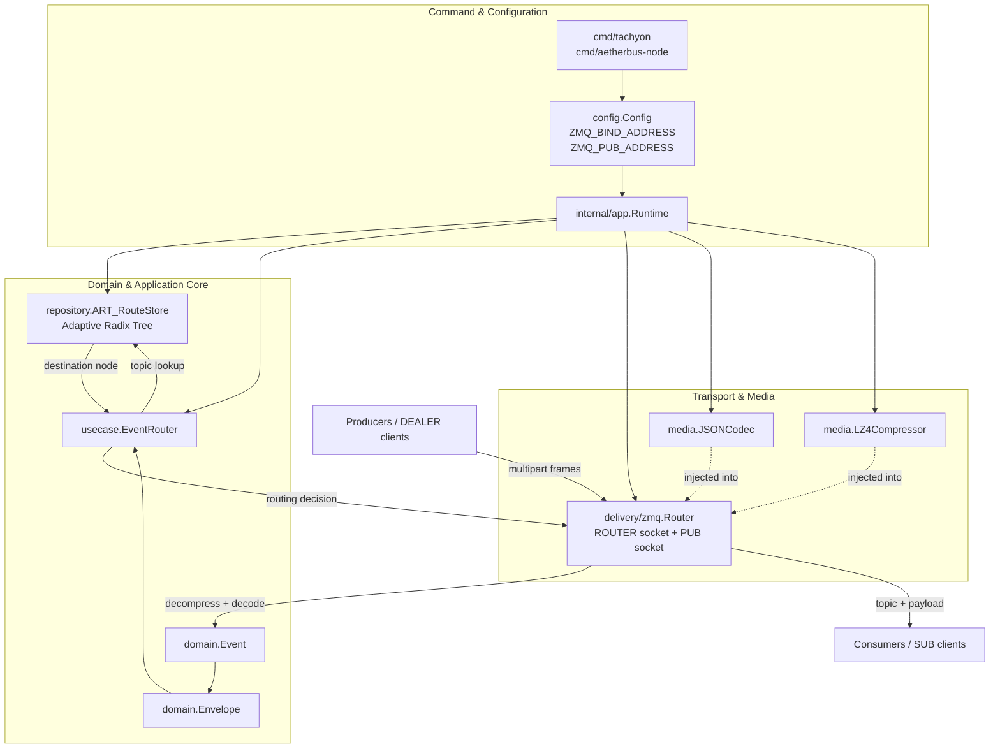

# AetherBus-Tachyon

**AetherBus-Tachyon** is a high-performance, lightweight message broker designed for the AetherBus ecosystem. It serves as a central routing point for events, ensuring efficient and reliable delivery from producers to consumers.

This project is currently under active development and aims to be a foundational component for building scalable, event-driven architectures.

## ✨ Features

- **High-Performance Routing:** Utilizes an **Adaptive Radix Tree** for fast and efficient topic-based routing, ensuring low-latency message delivery even with a large number of routes.
- **Extensible Media Handling:** Supports pluggable codecs and compressors to optimize message payloads.
  - **Codec:** Defaulting to `JSON` for structured data.
  - **Compressor:** Defaulting to `LZ4` for high-speed compression and decompression.
- **ZeroMQ Integration:** Built on top of ZeroMQ (using `pebbe/zmq4`), leveraging its powerful and battle-tested messaging patterns (ROUTER-DEALER, PUB-SUB).
- **Clean Architecture:** Organized with a clear separation of concerns (domain, use case, delivery, repository, media, app runtime) for maintainability and testability.
- **Continuous Integration:** Includes a **GitHub Actions workflow** that automatically builds the application and runs tests (including race detection) on every push and pull request to the `main` branch.

## 🚀 Getting Started

### Prerequisites

- [Go](https://golang.org/dl/) (version 1.22 or later)
- [ZeroMQ](https://zeromq.org/download/) (version 4.x)

On Debian/Ubuntu, you can install ZeroMQ development libraries with:

```bash
sudo apt-get update && sudo apt-get install -y libzmq3-dev
```

### Installation

1. **Clone the repository:**
   ```bash
   git clone https://github.com/aetherbus/aetherbus-tachyon.git
   cd aetherbus-tachyon
   ```

2. **Install dependencies:**
   ```bash
   go mod tidy
   ```

3. **Run the server:**
   ```bash
   go run ./cmd/tachyon
   ```

The server will start and bind to the addresses specified in the configuration (defaults to `tcp://127.0.0.1:5555` for the ROUTER and `tcp://127.0.0.1:5556` for the PUB socket).

## 🧰 Build recovery under restricted network environments

This repository may require external Go module resolution to complete full recovery of
`go.mod` / `go.sum` and to run `go test ./...`.

To make troubleshooting easier, use the recovery helper:

### Offline-safe checks

Use this mode when your environment cannot reach external Go module infrastructure:

```bash
bash scripts/go_mod_recovery.sh check
```

This mode is useful for:

- validating repository structure
- checking command entrypoints
- running package-level tests for explicitly selected offline-safe packages

By default, it tests:

```bash
go test ./cmd/aetherbus
```

### Full online recovery

Use this mode on a machine or CI runner with module download access:

```bash
bash scripts/go_mod_recovery.sh recover
```

This runs:

- `go mod download`
- `go mod tidy`
- `go build ./...`
- `go test ./...`

### Diagnostics

To inspect the current Go environment:

```bash
bash scripts/go_mod_recovery.sh doctor
```

### Why this split exists

Some failures are caused by local source issues, while others are caused by incomplete
module metadata (`go.sum`) that cannot be repaired without downloading or verifying
dependencies.

In restricted-network environments, the offline-safe path helps confirm whether a failure
is local to the codebase or caused by module resolution limits.

If `recover` fails with module download/verification errors in restricted environments,
treat that as an environment limitation first (not an automatic source regression).

## 🏗️ System Architecture Diagram



### Runtime composition

- **Command layer:** `cmd/tachyon` and `cmd/aetherbus-node` load configuration and start the broker runtime.
- **Configuration layer:** `config.Config` defines the ROUTER/PUB bind addresses.
- **Composition layer:** `internal/app.Runtime` wires the core components together.
- **Transport layer:** `internal/delivery/zmq.Router` owns the ZeroMQ ROUTER/PUB sockets and performs frame parsing.
- **Media layer:** `internal/media.JSONCodec` and `internal/media.LZ4Compressor` handle event encoding and payload compression.
- **Application layer:** `internal/usecase.EventRouter` resolves where an event should be routed.
- **Repository layer:** `internal/repository.ART_RouteStore` stores topic routes in an Adaptive Radix Tree.
- **Domain model:** `domain.Event` and `domain.Envelope` represent the message and routing metadata passed through the system.

### Message path

1. **Producers** publish multipart frames to the ZeroMQ ROUTER.
2. **`delivery/zmq.Router`** parses frames, decompresses payloads, and decodes them into `domain.Event`.
3. The transport layer wraps the event into **`domain.Envelope`**.
4. **`usecase.EventRouter`** performs topic lookup through **`repository.ART_RouteStore`**.
5. The routing decision returns to the transport layer.
6. The ZeroMQ PUB socket forwards the topic and payload to **subscribers / workers**.

This structure reflects the current codebase more closely than a generic broker diagram and keeps the runtime wiring, routing store, and transport/media responsibilities clearly separated.

## 💡 Function Proposals & Future Extensions

> This section intentionally lists **forward-looking proposals only**. Completed work should be documented in changelogs, release notes, or implementation-specific sections rather than mixed into the proposal backlog.

### English

- **Binary Frame Transport Path:** Introduce a compact binary frame header so the broker can route messages by topic without decoding large payloads first.
- **Large-payload Streaming Mode:** Add chunked transfer and streaming delivery for 1MB+ payload classes to reduce memory spikes and improve throughput.
- **Rust Fast-path Sidecar / FFI Module:** Move compression, framing, and large-payload processing into a Rust fast path while keeping Go for orchestration.
- **ACK/NACK Control Messages:** Add explicit control-plane messages for delivery acknowledgment, retry signaling, and negative acknowledgment.
- **Backpressure & Admission Control:** Add queue-depth-based throttling, rate limits, and overload protection policies.
- **Durable Spool / WAL Layer:** Add optional local durability for replay, crash recovery, and delayed redelivery workflows.
- **Admin API & Runtime Introspection:** Expose route inspection, connected clients, inflight counters, and broker health via HTTP or gRPC.
- **Schema Registry Integration:** Support schema version validation for structured payloads and safer producer/consumer evolution.
- **Rule-based Message Filtering:** Allow consumers to subscribe with filter expressions beyond exact topic matching.
- **Federation / Cluster Routing:** Extend single-node routing into multi-node broker meshes with route propagation and failover.
- **Benchmark & Profiling Harness:** Add a first-class benchmark command with p50/p95/p99 latency, throughput, memory, and allocation reporting.
- **Object-store Payload References:** Allow oversized payloads to be stored externally while the broker transports only metadata and retrieval references.

### ภาษาไทย

- **เส้นทางส่งข้อมูลแบบ Binary Frame:** เพิ่ม header แบบไบนารีเพื่อให้ broker ตัดสินใจ route ได้จากหัวข้อ โดยไม่ต้อง decode payload ขนาดใหญ่ก่อน
- **โหมดส่งข้อมูลขนาดใหญ่แบบ Streaming:** รองรับการแบ่งชิ้นและส่งต่อแบบ stream สำหรับ payload ระดับ 1MB ขึ้นไป เพื่อลดการใช้หน่วยความจำและเพิ่ม throughput
- **Rust Fast-path แบบ Sidecar / FFI:** ย้ายงาน framing, compression และเส้นทาง payload ใหญ่ไปยังโมดูล Rust โดยคง Go ไว้สำหรับ orchestration
- **ACK/NACK Control Messages:** เพิ่มข้อความควบคุมสำหรับยืนยันการส่ง แจ้ง retry และปฏิเสธข้อความอย่างชัดเจน
- **Backpressure และ Admission Control:** เพิ่มกลไกชะลอโหลด จำกัดอัตรา และป้องกันระบบล้นตามความลึกของคิวและสถานะ runtime
- **Durable Spool / WAL:** เพิ่มตัวเลือกสำหรับเก็บข้อมูลชั่วคราวแบบคงทน เพื่อรองรับ replay, crash recovery และ delayed redelivery
- **Admin API และ Runtime Introspection:** เปิด API สำหรับตรวจ route, client ที่เชื่อมต่ออยู่, inflight counters และสุขภาพของ broker
- **การเชื่อมต่อ Schema Registry:** รองรับการตรวจสอบเวอร์ชันของ schema สำหรับ payload แบบ structured เพื่อให้ producer/consumer เปลี่ยนแปลงได้ปลอดภัยขึ้น
- **Rule-based Message Filtering:** ให้ consumer สมัครรับข้อความด้วยเงื่อนไขการกรองที่ยืดหยุ่นกว่าการ match topic แบบตรงตัว
- **Federation / Cluster Routing:** ขยายจาก single-node broker ไปสู่ broker mesh หลายโหนด พร้อม route propagation และ failover
- **Benchmark และ Profiling Harness:** เพิ่มคำสั่ง benchmark อย่างเป็นทางการ พร้อมรายงาน p50/p95/p99, throughput, memory และ allocations
- **Object-store Payload References:** เปิดทางให้ payload ที่มีขนาดใหญ่มากถูกเก็บภายนอก และให้ broker รับส่งเฉพาะ metadata กับ reference สำหรับดึงข้อมูล

## 📘 Deep Architecture & Protocol Docs

To move AetherBus-Tachyon toward a production-grade broker spec, the repository now defines deeper system contracts in dedicated documents:

- [Protocol Specification v1 (draft)](docs/PROTOCOL.md)
- [Routing Semantics (ART)](docs/ROUTING.md)
- [Delivery Semantics (ACK/Retry/Backpressure/DLQ)](docs/DELIVERY.md)
- [Performance Model and Benchmarking](docs/PERFORMANCE.md)

These docs lock down the key areas that must be explicit for production evolution:

- Protocol envelope and control messages (register/ack/nack)
- Topic grammar and wildcard matching precedence
- Delivery guarantees and retry/dead-letter behavior
- Operational model (backpressure, failure handling, observability)

## Specifications

- [Protocol Specification](docs/PROTOCOL.md)
- [Routing Specification](docs/ROUTING.md)
- [Delivery Specification](docs/DELIVERY.md)
