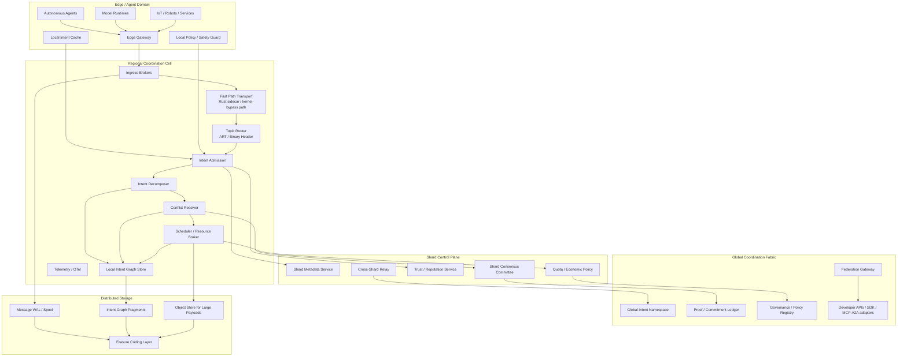

# Hyperscale Reference Architecture

*AI Coordination Layer of the Internet*

The whitepaper already sketches compute nodes, storage nodes, orchestration nodes, gRPC, Kafka, IPLD, sharding, erasure coding, and edge computing for 10,000+ nodes. This document extends that to a full hyperscale reference model.

## 3.1 Layered View

## 3.2 Node Classes

### A. Edge / Agent Nodes

Run close to inference and action loops. Responsibilities:

- low-latency intent submission
- local cache / local fail-safe
- offline-tolerant operation
- small-scope coordination

### B. Coordination Cells

Main execution unit. Each cell includes:

- ingress broker
- fast-path transport
- topic routing
- intent admission
- decomposer
- conflict resolver
- scheduler
- local graph store

This is the practical successor to today’s Tachyon broker.

### C. Shards

A shard is a bounded coordination domain:

- policy-consistent
- latency-bounded
- consensus-scoped
- failure-isolated

### D. Global Fabric

Handles:

- federation
- naming
- interoperability
- governance
- durable proofs
- economic policy

## 3.3 Data Planes and Control Planes

### Data Plane

- binary frames
- streaming payloads
- object-reference transport for large artifacts
- zero-copy / kernel-bypass optimized paths where justified

### Intent Plane

- intent admission
- decomposition
- candidate matching
- conflict resolution
- scheduling
- commitment generation

### Trust Plane

- identity
- attestations
- trust score updates
- anomaly / abuse signals

### Governance Plane

- policy registry
- tenant controls
- org boundaries
- compliance / audit / provenance

## 3.4 Hyperscale Scaling Strategy

- **Horizontal cell replication**: scale local throughput by adding cells.
- **Intent graph sharding** by tenant, namespace, geography, workflow, or capability class.
- **Hierarchical coordination**: most intents resolve locally; unresolved/cross-domain intents escalate upward.
- **Payload bifurcation**: keep small control messages inline; move large payloads to chunked streams or object-store references.

This separation is essential for evolving from a larger message broker into an actual internet-scale coordination fabric.

## 3.5 Fault Model

Assume:

- crash faults
- omission faults
- partition faults
- Byzantine minority within committee bounds
- stale graph fragments
- duplicate / reordered message delivery

Resilience methods:

- segmented WAL + replay
- standby/object-store segment replication with explicit durability acks
- erasure-coded storage
- shard-level BFT only where needed
- idempotent execution receipts
- compensating transactions for cross-shard failure

### 3.5.1 Direct-Delivery Durability Tier

For regional coordination cells, direct-delivery recovery should not depend on a single node-local file. Each ingress broker should persist direct-delivery state as ordered WAL segments, roll segments at bounded sizes, and ship segment images to a standby broker or object store.

Recommended guarantees:

- local durability is satisfied by fsync of the active segment
- cell-survivable durability is satisfied by acknowledged remote replication of that segment
- startup recovery replays all intact segments, ignores a truncated tail only on the newest open segment, and treats corruption in closed segments as a restore-from-replica event
- dead-letter, scheduled retry, and resumable-session snapshots should be restored alongside WAL segments so replay preserves operational intent rather than only raw payload bytes

## 3.6 Interoperability

To become an internet coordination layer, AetherBus should avoid forcing a single agent protocol.

Adapters should exist for:

- MCP
- A2A / ACP / ANP-style agent protocols
- gRPC
- HTTP/WebSocket
- event streams
- DID-based identity / signed provenance

## 3.7 Phased Build-Out

The whitepaper roadmap already sequences prototype → pilot → hyperscale → global AI coordination layer.
Operationalized phases:

### Phase 1 — Broker Core

- Tachyon broker
- ART routing
- binary frame header
- benchmark harness
- no-op / LZ4 paths
- ACK/NACK

### Phase 2 — Intent Core

- intent admission
- decomposition
- local graph
- conflict resolution
- scheduling
- trust scoring

### Phase 3 — Sharded Coordination

- shard metadata
- cross-shard relay
- durable spool
- object references
- regional cells

### Phase 4 — Global Fabric

- federation gateways
- governance registry
- global namespace
- interoperability adapters
- proof / commitment ledger

## 3.8 Architectural Principles

1. **Formal state model** so safety/liveness/fairness can be reasoned about.
2. **Intent graph as a first-class runtime object**, not merely routing metadata.
3. **Hierarchical hyperscale architecture**: local-first, shard-aware, global-federated.
4. **Proof-bearing coordination semantics** for exactness, trust, governance, and dispute handling.
