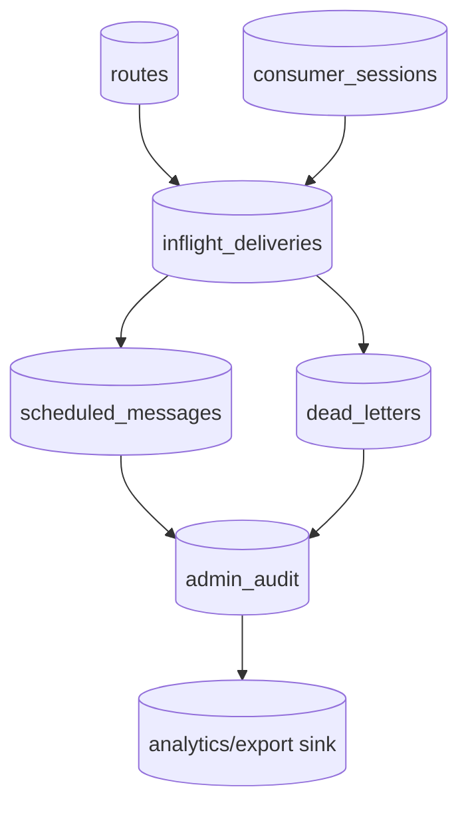

# State Store Architecture

## Current state

The broker currently keeps hot operational state in memory and persists recoverable subsets to file-backed stores:

- routes: versioned route catalog snapshot
- consumer sessions: resumable logical session snapshots
- inflight deliveries: append-only WAL dispatch/commit records
- scheduled messages: versioned delayed-delivery queue snapshot
- dead letters: versioned DLQ snapshot
- admin audit: append-only tamper-evident hash chain with a head sidecar

## Target state

The eventual database-backed state store is the operational source of truth for:

1. routing catalog
2. delivery state machine
3. scheduled/retry state
4. DLQ operational control
5. audit trail

Analytics and export sinks remain downstream copies, not the source of truth.

## Entity model

## Migration direction

- Keep runtime logic depending on store abstractions instead of file layouts.
- Preserve file-backed stores as the reference implementation and migration fallback.
- Add DB-backed implementations per entity family behind the same interfaces.
- Use explicit `{version,data}` persistence envelopes so file snapshots remain migratable.
