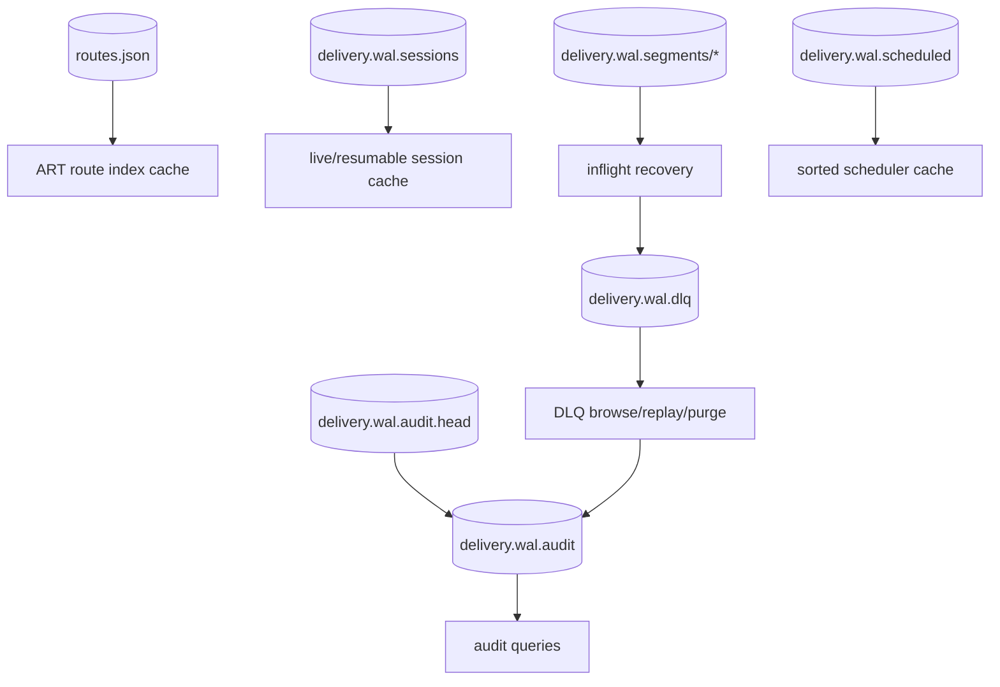

# AetherBus-Tachyon State Store

## Objective

This document defines the target **source-of-truth boundaries** for Tachyon so the current file-backed implementation can evolve cleanly into a DB-backed state store without changing delivery or routing use cases.

## Source of truth by concern

### 1. Routing catalog
**Source of truth:** persisted route catalog.

- Stores tenant-scoped route definitions.
- Includes exact, `*`, and `>` wildcard patterns.
- Must preserve deterministic precedence metadata (`route_type`, priority, stable tie-break inputs).
- Runtime indexes such as the ART tree are caches derived from this catalog, not authoritative state.

### 2. Direct delivery state machine
**Source of truth:** append-only direct-delivery WAL plus finalized DLQ/audit state.

- Records dispatch, commit, and terminal dead-letter outcomes.
- Restart recovery must reconstruct pending direct deliveries from persisted facts rather than runtime memory.
- In-memory inflight maps and per-consumer counters are runtime-only caches.

### 3. Scheduled and retry queue
**Source of truth:** persisted scheduled queue.

- Stores delayed first-delivery and retry entries.
- Persists resolved direct destination, tenant, topic, attempt, enqueue sequence, and delivery timestamp.
- Runtime timers and sorted slices are derived scheduling structures, not authoritative state.

### 4. Consumer resumability
**Source of truth:** persisted resumable session snapshot store.

- Stores only logical resumable metadata needed after restart.
- MUST NOT persist transport identities or live-only counters.
- Previous socket identity is never authoritative after restart; the consumer must re-register.

### 5. Dead-letter operations
**Source of truth:** persisted dead-letter store.

- Stores operator-visible DLQ records, replay metadata, and tenant boundaries.
- Replay removes the DLQ record and creates a scheduled retry entry.
- Purge is a terminal administrative mutation and must be reflected in audit.

### 6. Administrative audit trail
**Source of truth:** append-only audit log plus versioned head sidecar.

- Audit is immutable append-only history for replay/purge/manual DLQ actions.
- The head sidecar is an optimization for append; the log file remains the canonical record.
- Export pipelines are downstream replicas, not authoritative records.

## What is explicitly runtime-only

The following state should stay in memory and be recomputed/rebuilt as needed:

- live ZeroMQ socket identities
- per-session inflight counters
- backlog counters
- ART route index nodes
- queue-limit policy samples
- exporter cursors and transient metrics snapshots

Persist these only if they become part of a documented recovery contract.

## Current file-backed reference layout

## Abstraction boundary

Runtime code should depend on store behaviors, not file shapes:

- route catalog store
- resumable session snapshot store
- scheduled message store
- dead-letter store
- audit append/query store
- append-only dispatch WAL

The current file-backed implementations are the reference adapters behind those boundaries. A future DB-backed implementation should preserve the same contracts while changing only storage adapters.
